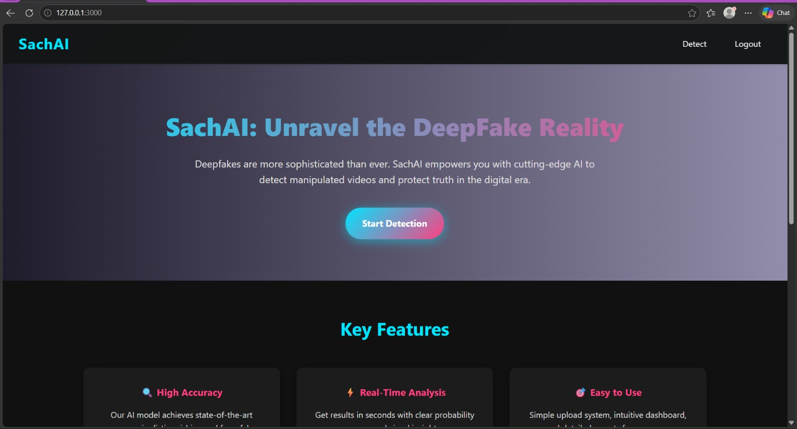
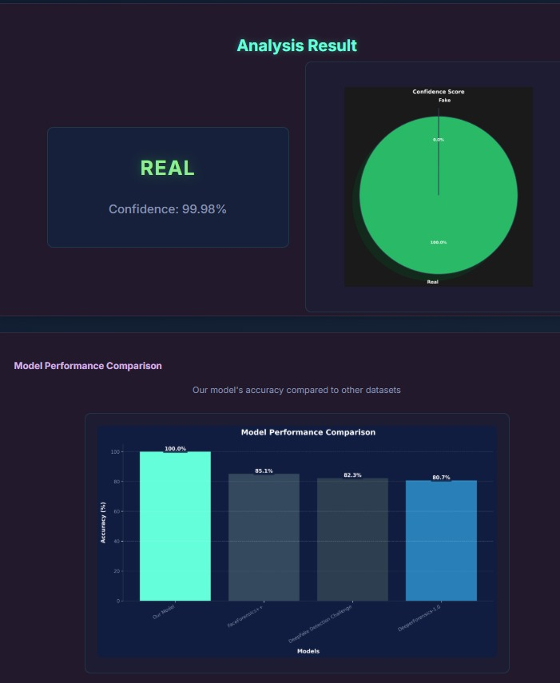

# 🎭 DeepFake Video Detection System

> A full-stack web application that detects deepfake videos using a hybrid *ResNeXt50 + LSTM* deep learning model, trained on the *Celeb-DF* dataset. Built with Flask (backend) and React (frontend).


---

## 🎯 Problem Statement

With the rapid rise of AI-generated manipulated media, detecting forged videos has become critical for preventing misinformation, enhancing cybersecurity, and maintaining digital trust.
This project provides an automated pipeline to analyze videos and classify them as *REAL* or *FAKE* using deep learning.

---

## 🔍 Overview

Deepfake technology uses GANs to generate highly realistic fake videos. This system:

* Accepts video uploads (MP4, AVI, MOV — up to 500MB)
* Extracts and processes frames using computer vision techniques
* Detects facial regions using face_recognition
* Classifies frames using a hybrid *ResNeXt50 + LSTM* model
* Produces a final video-level prediction with confidence score
* Visualizes results using charts
* Provides an *Admin Dashboard* for dataset management

---

## 🖼️ Demo

markdown




---

## 🧠 Architecture

### Stage 1 — Spatial Feature Extraction (ResNeXt50)

* Extracts frame-level features
* Detects visual artifacts like blending inconsistencies

### Stage 2 — Temporal Modeling (LSTM)

* Captures sequence-based inconsistencies
* Learns temporal anomalies across frames

### Pipeline Flow

```
Input Video
     ↓
Frame Extraction (OpenCV)
     ↓
Face Detection (face_recognition)
     ↓
Preprocessing (Resize + Normalize)
     ↓
ResNeXt50 (Feature Extraction)
     ↓
LSTM (Sequence Learning)
     ↓
Fully Connected Layer + Softmax
     ↓
Output: REAL / FAKE + Confidence Score
```

---

## 📂 Dataset

*Celeb-DF (v2)* — High-quality deepfake dataset

| Property    | Details |
| ----------- | ------- |
| Real Videos | 590     |
| Fake Videos | 5,639   |
| Total Clips | ~6,229  |
| Resolution  | 720p+   |

---

## 🗂️ Project Structure

```
DeepFake-Detection_Video/
│
├── server.py
├── models.py
│
├── model/
│   └── df_model.pt (hidden)
│
└── requirements.txt

```
---

## ✅ Prerequisites

* Python 3.8+
* Node.js 16+
* Git
* pip
* (Optional) CUDA GPU

---

## ⚙️ Installation

### 1. Clone Repo
```
git clone https://github.com/cse-kiet/PCSE26-46.git
```
```
cd PCSE26-46/DeepFake-Detection_Video
```

### 2. Create Virtual Environment
```
python -m venv venv
```

Activate:

* Windows:
```
venv\Scripts\activate
```

* Linux/macOS:
```
source venv/bin/activate
```

### 3. Install Dependencies
```
pip install -r requirements.txt
```

### 4. Add Model File

Place trained model at:
model/df_model.pt

### 5. Install Frontend

```
npm install
```

---

## 🚀 Running the Application

### Backend
```
python server.py
```

Runs at: *http://localhost:3000*

### Frontend
```
npm start
```

Runs at: *http://localhost:3001*

---

## 🖥️ Usage

### User Flow
```
1. Signup → /signup
2. Login → /login
3. Upload video → /detect
4. View:

   * Prediction (REAL / FAKE)
   * Confidence score
   * Graphs
   * Extracted frames
```
### Admin
```
* Access /admin
* Upload datasets
* Manage data
```
---

## 🔌 API Endpoints

| Method | Endpoint  | Description     |
| ------ | --------- | --------------- |
| GET    | /       | Home            |
| GET    | /login  | Login page      |
| POST   | /login  | Authenticate    |
| GET    | /signup | Signup page     |
| POST   | /signup | Register        |
| GET    | /detect | Upload page     |
| POST   | /detect | Prediction      |
| GET    | /admin  | Admin dashboard |

---

## 📊 Results

* Model trained on Celeb-DF dataset
* Achieved *~96% validation accuracy* during internal experiments

> Note: Performance may vary depending on input video quality and preprocessing.

---

## 🛠️ Technologies Used

| Layer        | Technology               |
| ------------ | ------------------------ |
| Backend      | Flask, Python            |
| ML Framework | PyTorch                  |
| Model        | ResNeXt50 + LSTM         |
| CV Tools     | OpenCV, face_recognition |
| Frontend     | React                    |
| Database     | SQLite                   |

---

## 🚧 Future Improvements

* Cloud deployment (AWS / GCP)
* Real-time webcam detection
* Faster inference (ONNX / TensorRT)
* Explainable AI (Grad-CAM)
* REST API for external integration

---

## 📜 License

This project is for *academic and educational purposes only*.

---

## ⭐ Acknowledgements

* KIET Faculty & Mentors
* Open-source community
 
